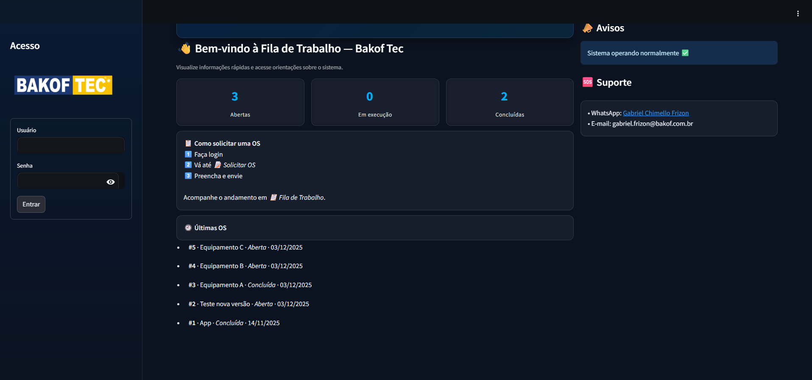
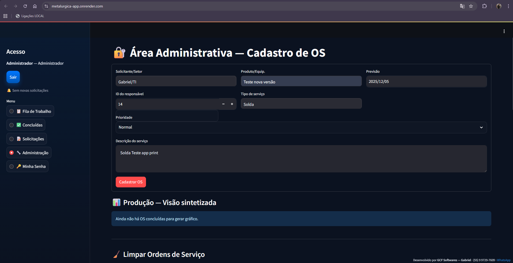
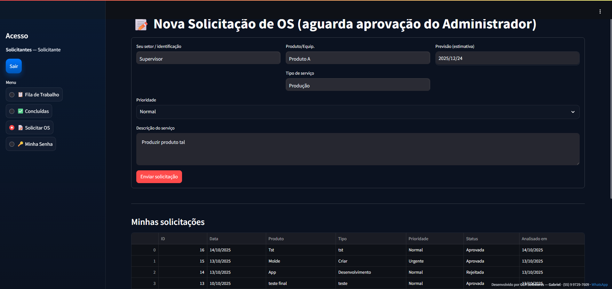
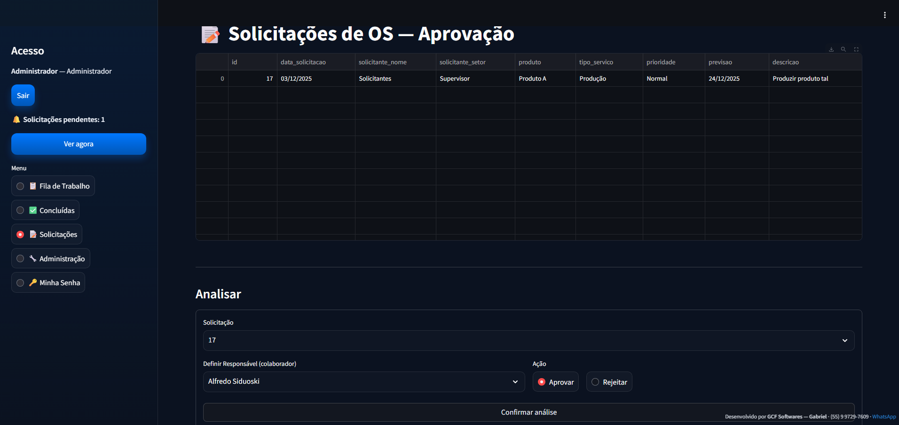
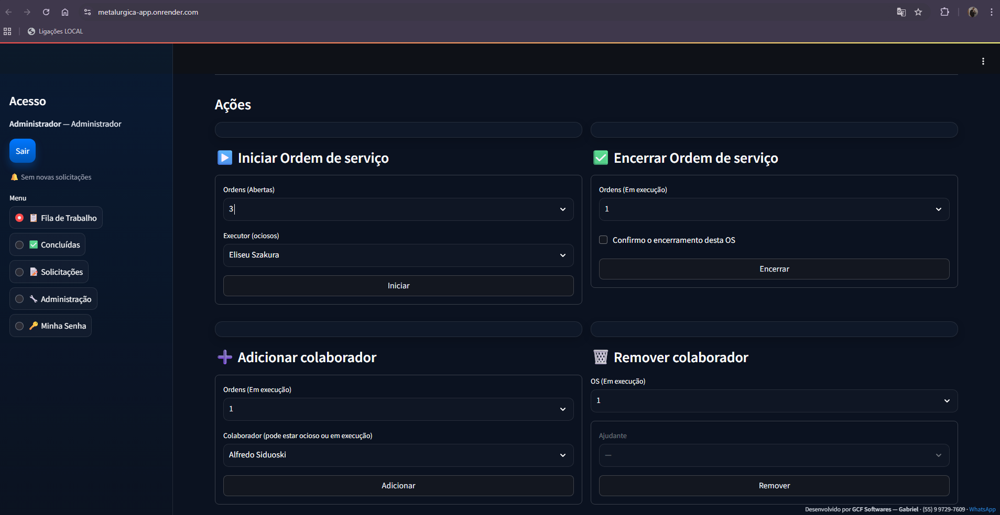
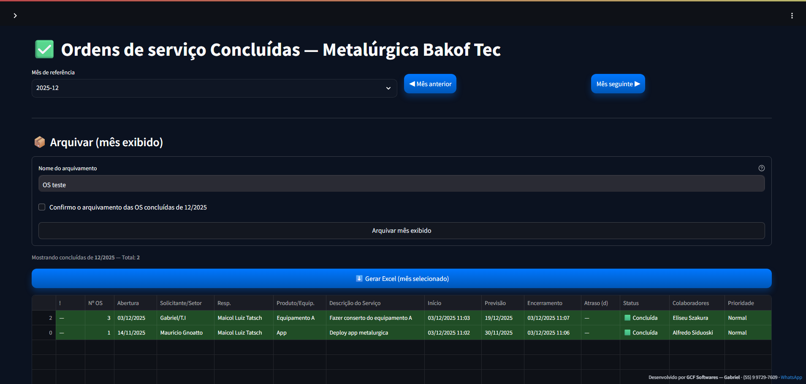
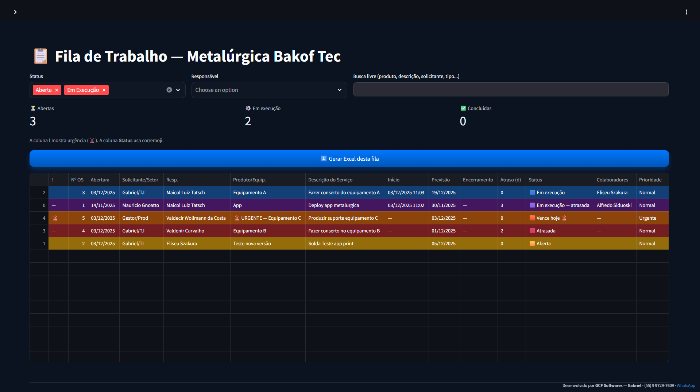
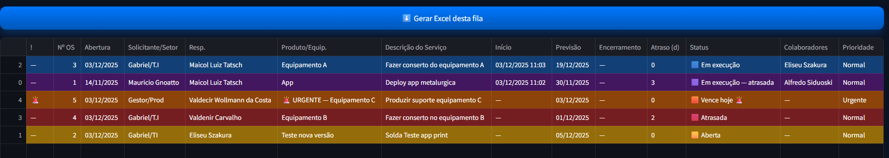
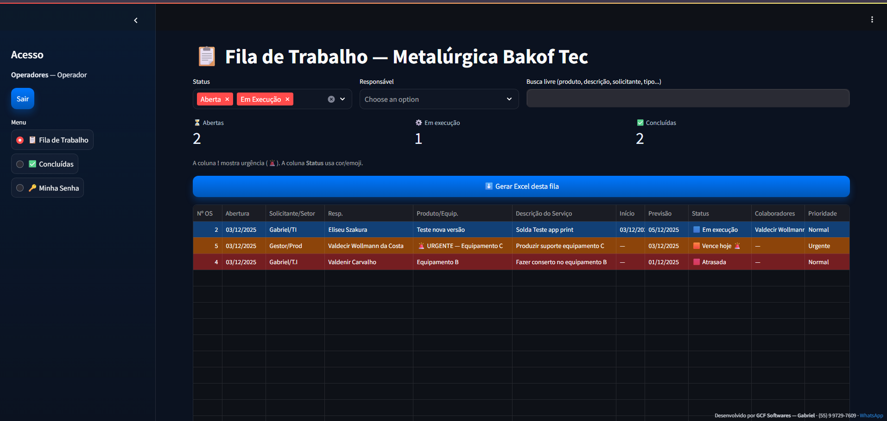

# Bakof-Work-Orders-Manager
# Bakof Work Orders Manager  
📌 Sistema corporativo de gestão de Ordens de Serviço — implantado e utilizado em produção pela Bakof Tec

Este projeto foi desenvolvido sob demanda para a **Bakof Tec**, com o objetivo de melhorar o fluxo operacional, registro, acompanhamento e análise das ordens de serviço.

> Esta é uma versão de portfólio — sem credenciais reais e com configurações genéricas.

---

## 🔥 Objetivo do sistema

Organizar de forma clara e centralizada todos os pedidos de serviço, permitindo:

✔ rastreabilidade  
✔ priorização  
✔ responsabilidade definida  
✔ histórico consultável  
✔ indicadores de desempenho  

Além disso, reduz comunicação perdida por WhatsApp, bilhetes ou verbal.

---

## ✨ Funcionalidades principais

- Login com perfis (Administrador, Operador e Solicitante)
- Cadastro de ordens de serviço
- Workflow: Em Aberto → Execução → Concluída
- Prioridade: Normal / Urgente
- Fila com filtros e destaques visuais (verde, amarelo, vermelho)
- Atribuição a executores e ajudantes
- Painel de conclusão e arquivamento mensal
- Exportação para Excel
- Gráficos com Plotly
- Gestão de colaboradores (inativação com validação de vínculo)
- Alteração de senha com política forte
- Migração automática SHA → bcrypt de senhas antigas

---

## 🧠 Tecnologias utilizadas

**Backend & UI**  
- Python  
- Streamlit  

**Banco / Persistência**  
- MySQL  
- mysql-connector (connection pooling)

**Visualização e relatórios**  
- Plotly  
- Pandas  
- Styled DataFrames

**Autenticação & segurança**  
- bcrypt (hash robusto)

**Deploy / Infraestrutura**  
- Render / AlwaysData  
- Deploy contínuo por GitHub

## 📸 Screenshots da aplicação

### 🔐 Login

### 🏭 Area Administrativa

### 📝 Solicitação de OS

### 📤 Aprovação / Análise

### 🔧 Ações Operadores (Iniciar / Encerrar OS + Colaboradores)

### 📦 Tela de Concluídas / Arquivamento

### 📊 Fila de Trabalho (Visão Geral)

### 🔍 Zoom interpretativo da Fila

### 👥 Perspectiva do operador

 

---
